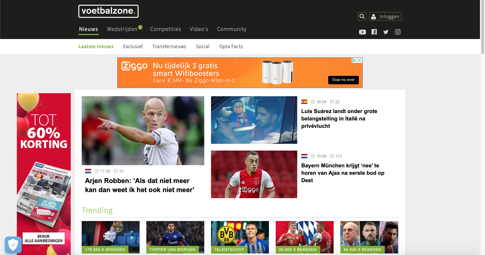

# Procesverslag
**Auteur:** Adil Yakubi

Markdown cheat cheet: [Hulp bij het schrijven van Markdown](https://github.com/adam-p/markdown-here/wiki/Markdown-Cheatsheet). Nb. de standaardstructuur en de spartaanse opmaak zijn helemaal prima. Het gaat om de inhoud van je procesverslag. Besteedt de tijd voor pracht en praal aan je website.

## Bronnenlijst
1. -bron 1-
2. -bron 2-
3. -...-

## Eindgesprek (week 7/8)

-dit ging goed & dit was lastig-

**Screenshot(s):**

-screenshot(s) van je eindresultaat-

## Voortgang 3 (week 6)

-same as voortgang 1-

## Voortgang 2 (week 5)

-same as voortgang 1-

## Voortgang 1 (week 3)

### Stand van zaken

-dit ging goed & dit was lastig-
Veel code moeten wijzigen omdat positonering niet klopte. Aantal tips van de lessen in meegenomen dat heeft gewerkt.

**Screenshot(s):**

-screenshot(s) van hoe ver je bent-
(images/1.png)
(images/2.png)
(images/3.png)

### Agenda voor meeting

-samen met je groepje opstellen-
B2

### Verslag van meeting

-na afloop snel uitkomsten vastleggen-

## Intake (week 1)

**Je startniveau:** -blauw-

**Je focus:** -responsive-

**Je opdracht:** -www.voetbalzone.nl-

**Screenshot(s):**

**Breakdown-schets(en):**

